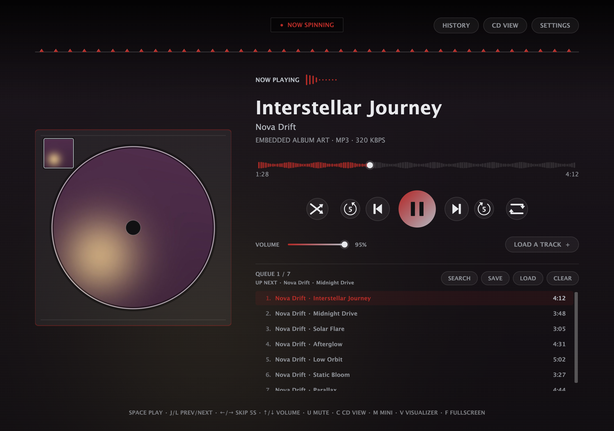
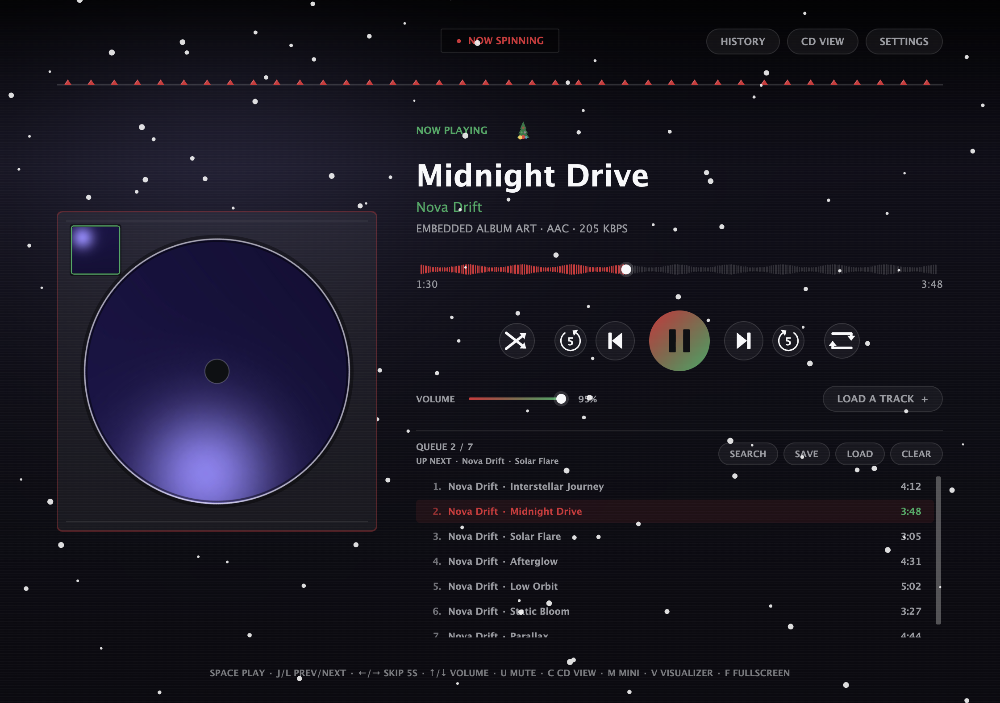
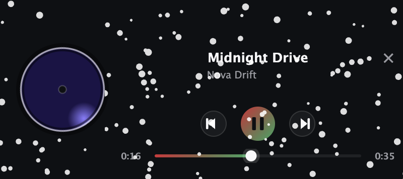
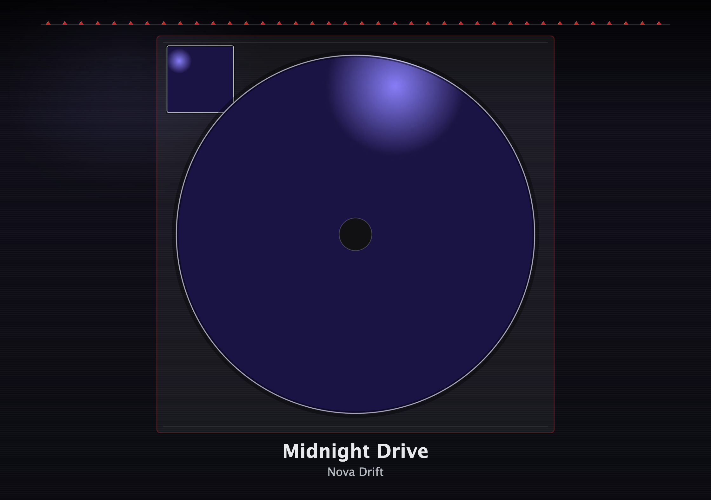
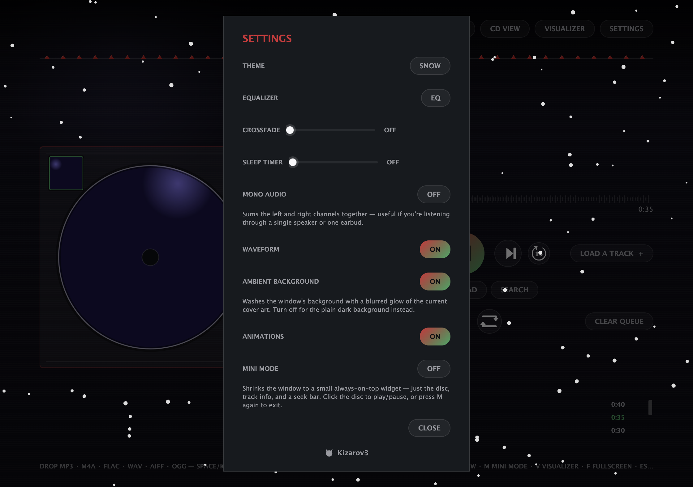

# CDPlayer

CDPlayer is a desktop music player that recreates the tactile feel of a physical CD player for your local music. Load a track, press play, and enjoy a simple, distraction-free listening experience — no accounts, no streaming, no internet required to play a song.

**Download it, open it, and it plays.** MP3, M4A (AAC *and* Apple Lossless), FLAC, WAV, AIFF, AU, OGG and Opus all work out of the box on macOS, Windows and Linux. There is nothing else to install — no FFmpeg, no Java.

<p align="center">
  
  
</p>

## Download

Grab the file for your system from the [**Releases**](https://github.com/Kizarov3/CDPlayer/releases) page:

| System | File | How to run |
| --- | --- | --- |
| **macOS** (Apple Silicon and Intel) | `CDPlayer-x.y.z-mac.dmg` | Open the `.dmg`, drag **CDPlayer** into **Applications** |
| **Windows** 10 / 11 | `CDPlayer-x.y.z-windows.exe` | Double-click it — no installation, runs straight from wherever you saved it |
| **Linux** (any distro) | `CDPlayer-x.y.z-linux.AppImage` | Make it executable (right-click → Properties → *Allow executing*, or `chmod +x`), then double-click |

When a newer version is released, a small **x.y.z AVAILABLE** button appears in the top-left corner of the player — click it to open this page. CDPlayer checks at most once a day and never downloads or installs anything by itself.

### First launch

These builds aren't signed with a paid Apple/Microsoft developer certificate, so the first time you open them your system asks you to confirm:

- **macOS:** if you see *"CDPlayer can't be opened because Apple cannot check it"*, right-click the app in Applications → **Open** → **Open**. (Or: System Settings → Privacy & Security → **Open Anyway**.) Only needed once.
- **Windows:** if SmartScreen says *"Windows protected your PC"*, click **More info** → **Run anyway**. Only needed once.
- **Linux:** nothing extra.

## Features

**Playback**
- Plays MP3, M4A (AAC and Apple Lossless/ALAC), FLAC, WAV, AIFF, AU, OGG and Opus — all built in
- Drag and drop individual files or whole folders (recursively) to build a queue, or use **Load a Track** — the file picker remembers the last folder you browsed
- Open files straight from Finder / Explorer (*Open With → CDPlayer*) or drop them on the app icon
- **CUE sheets**: an album ripped to one big file plus a `.cue` shows up as its separate tracks, with their own titles, and plays through them gaplessly, like the CD. The FILE line doesn't have to match exactly (a sheet written for `album.wav` finds `album.flac`), and older Windows cue sheets in Cyrillic or Western code pages read correctly
- Shuffle, and a three-way repeat cycle (off → repeat one track → repeat the whole queue), with an "Up Next" preview that always reflects what will actually play next
- Adjustable crossfade (0–15s) on an equal-power curve, so the transition doesn't dip in volume — only when the queue naturally advances, never when you pick a different track yourself
- Volume slider with instant response, blended correctly into an in-progress crossfade
- Mono audio toggle — sums left/right together, for a single speaker or one earbud
- A 10-band graphic **Equalizer** (31Hz–16kHz) with 8 built-in presets (Bass Boost, Treble Boost, Vocal, Rock, Pop, Classical, Electronic, Flat) plus your own saved presets
- The seek bar can show the track's real amplitude shape instead of a plain line
- True fullscreen (`F`), and keyboard shortcuts for everything (see below)

**Queue**
- Full queue list with per-track duration, click-to-play, and a hover-to-reveal remove (×) button
- Drag any row up or down to reorder the queue, even the one currently playing
- **Clear Queue** — with a few seconds to change your mind: the button turns into **UNDO CLEAR** (or press ⌘Z / Ctrl+Z) — "Up next" preview and live queue position (e.g. `QUEUE 3 / 10`)
- The queue, current track, and exact playback position are saved when you close the app and restored next launch — ready to play, not auto-started
- Save the queue as a standard `.m3u` playlist, or load one back in
- **Search** recursively scans your last-used music folder by filename, filtering live as you type
- Paste a Spotify track or playlist link into Search to queue every matching song you already have locally (nothing is streamed; playlist links need a one-time Spotify sign-in — see [Spotify setup](#spotify-optional))
- **IMPORT LIBRARY…** in Search bulk-imports from an exported iTunes/Music.app `Library.xml` or a Spotify export (CSV, or Spotify's own `YourLibrary.json`), matched against what you already have locally

**Now playing**
- Spinning disc in a jewel case, with your album art on the disc and the case thumbnail — double-click the disc for a little surprise
- Click the little cover in the jewel case's corner to open the album art full-size in place of the disc; click the art to put it back
- Live audio visualizer driven by the actual audio, pulsing on detected beats, with a shape that changes with the theme
- Artist, title and album from the file's tags, with the filename as a fallback
- The audio quality under the title: `FLAC · 24-BIT · 96 KHZ` for lossless files, `MP3 · 320 KBPS` for compressed ones
- Embedded album art, with automatic iTunes → Deezer → Spotify cover lookup when a file has none
- **Lyrics** — embedded lyrics, or an automatic [lrclib.net](https://lrclib.net) lookup. Timed (LRC) lyrics highlight and auto-scroll karaoke-style, and clicking a line jumps playback to it
- **History** — your last 50 tracks, one click away from playing again or adding back to the queue
- **CD view** (`C`) — just the enlarged spinning disc with the title and artist underneath, with a genie-style transition
- **Visualizer Mode** (`V`) — the whole window becomes the theme's audio-reactive visualizer; also kicks in on its own after a few idle minutes while playing, like a screensaver
- System media controls: macOS Control Center, the Windows media overlay and Linux desktop players show what's playing, and hardware media keys work

**Mini Mode**
- Press `M` (or flip the switch in Settings) for a compact always-on-top mini player, styled after Apple Music's: the spinning disc, title and "Artist — Album", a full-width seek bar with elapsed/remaining time, and shuffle · back · play/pause · forward · repeat. On macOS it's frosted glass like a native mini player
- Drag it anywhere (it remembers where); click the disc to play/pause; all the keyboard shortcuts work in it; `M`, `Esc` or the × that appears on hover brings the full player back

<p align="center">
  
</p>
<p align="center">
  
</p>

**Settings**
- Theme, Equalizer, Crossfade, Sleep Timer, Mono Audio, Waveform, Ambient Background, Animations and Mini Mode in one dialog
- **Ambient Background** washes the window with a blurred glow of the current cover art
- **Sleep Timer** pauses playback after up to 120 minutes, with a live countdown in the header (click it to cancel)
- Everything — volume, crossfade, mono, EQ, theme, waveform, animations, window size and position — persists across launches
- **Animations** toggle turns every hover fade, pulse and transition off at once

<p align="center">
  
</p>

**Themes**
- Ten themes — RED, BLUE, SUNSET, FOREST, GALAXY, OCEAN, MATRIX, AUTUMN, SNOW and AUTO — with a smooth animated color transition
- **AUTO** derives the whole palette from the current track's album art
- Five themes come with their own animated scenery and visualizer shape:
  - **SNOW** — falling snow; the visualizer is a pine tree whose lights pulse with the music
  - **GALAXY** — a twinkling starfield with shooting stars; a 5-star constellation that brightens with the beat
  - **OCEAN** — rising bubbles; reactive wave layers
  - **MATRIX** — falling green code rain; a miniature rain driven by the audio
  - **AUTUMN** — tumbling leaves; a branch whose leaves grow with the music

## Keyboard shortcuts

| Key | Action |
| --- | --- |
| `Space` or `K` | Play / Pause |
| `J` / `L` | Previous / next track |
| `←` / `→` | Skip back / forward 5 seconds |
| `↑` / `↓` | Volume up / down |
| `U` | Mute / unmute |
| `F` | Toggle fullscreen |
| `C` | Toggle CD view |
| `M` | Toggle Mini Mode |
| `V` | Toggle Visualizer Mode |
| `Esc` | Close whatever's open, or leave fullscreen / CD view / Visualizer Mode / Mini Mode |

## Coming from the Java version?

The original Java app lives on at [Kizarov3/CDPlayer-Legacy](https://github.com/Kizarov3/CDPlayer-Legacy). Your data carries over automatically: CDPlayer 2 reads and writes the same files in the same place (`~/.cdplayer` on macOS/Linux, `%LOCALAPPDATA%\CDPlayer` on Windows) — queue and position, history, settings, EQ presets, last folder and Spotify sign-in. You can uninstall Java and FFmpeg if nothing else needs them.

## Spotify (optional)

Everything else works without it. Spotify is only used as a third cover-art source and for resolving pasted Spotify links. To enable it, create a free app at [developer.spotify.com/dashboard](https://developer.spotify.com/dashboard) with the redirect URI `http://127.0.0.1:8080/callback`, then put its **Client ID** on the first line and **Client Secret** on the second line of `spotify.txt` in the data folder above.

## Build from source

You need [Node.js](https://nodejs.org) 20 or newer.

```bash
npm install
npm start            # run the app
npm test             # unit tests (decoders, state files, playlists, lyrics)
npm run dist         # build installers for the current OS into dist/
```

`npm run dist:mac`, `dist:win` and `dist:linux` build a specific platform (Windows and Linux builds can be made from a Mac too). Pushing a `v*` tag runs [the GitHub Actions workflow](.github/workflows/build.yml), which tests and packages on all three operating systems, smoke-tests each packaged app by decoding every supported format, and attaches the downloads to a GitHub Release.

### How it's built

- [Electron](https://www.electronjs.org) — the app shell; Chromium's built-in decoders handle MP3, AAC, FLAC, WAV, OGG and Opus on every OS
- Pure-JavaScript decoders in [`src/main/decoders`](src/main/decoders) for the formats Chromium doesn't cover: Apple Lossless (a port of Apple's open-source ALAC decoder), AIFF/AIFF-C and Sun AU — verified bit-exact against reference output in the tests
- [music-metadata](https://github.com/borewit/music-metadata) for tags, cover art and embedded lyrics
- The UI is hand-drawn on canvas to match the original: [`src/renderer`](src/renderer)

## License

MIT — see [LICENSE](LICENSE).
