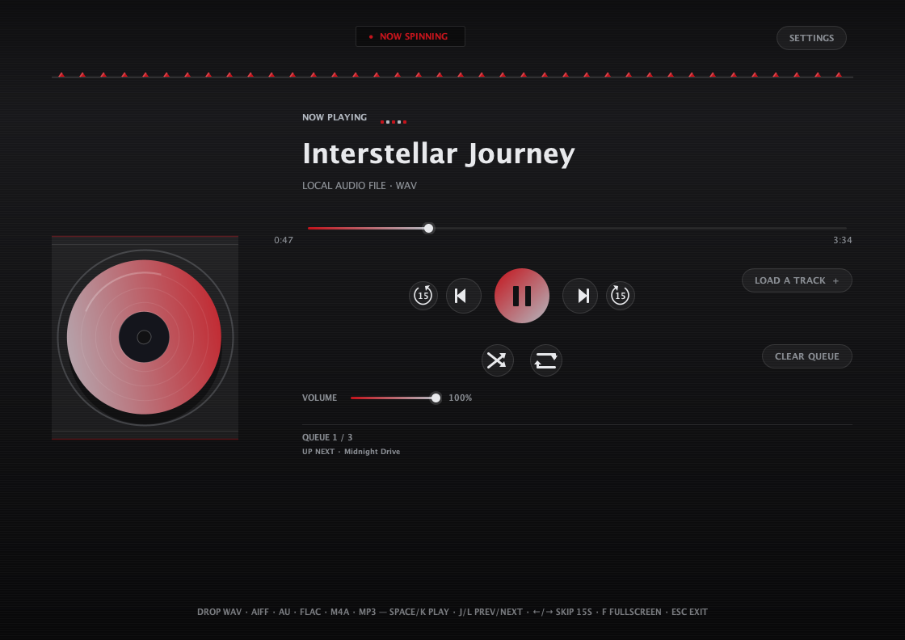
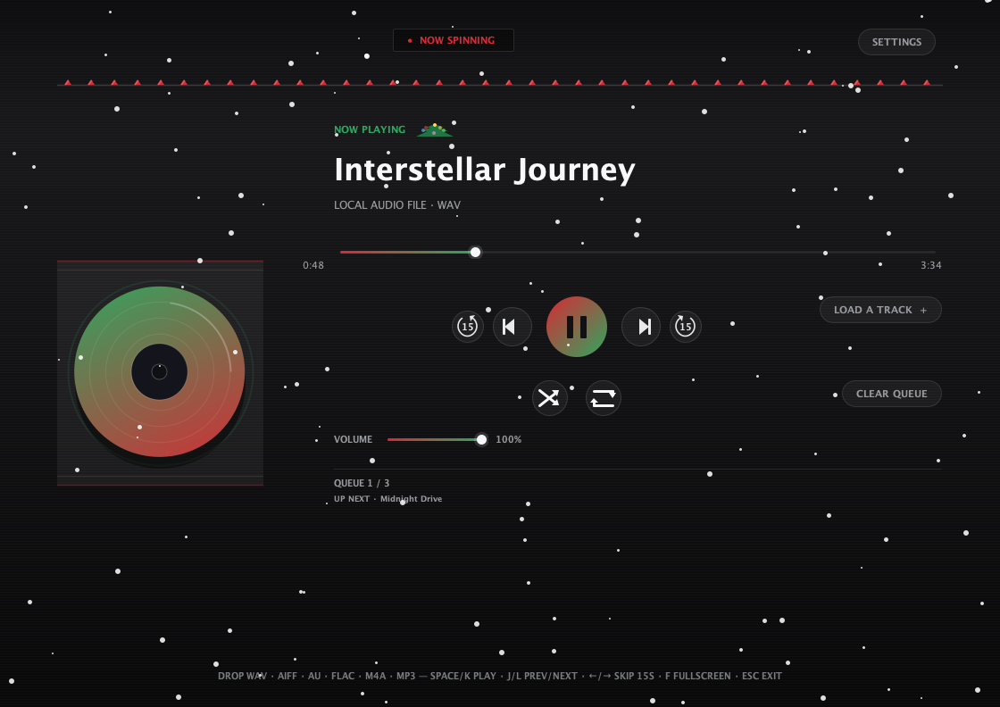
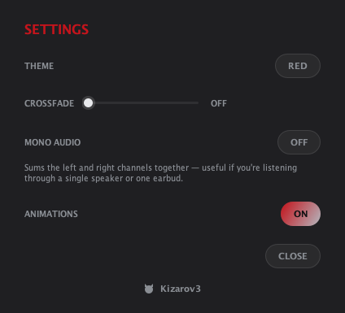

# CDPlayer

CDPlayer is a Java desktop app that recreates the tactile feel of a physical CD player for local audio playback. Load a track, press play, and enjoy a simple, distraction-free music experience without relying on a browser or web app — no accounts, no streaming, no internet required to play a song.

<p align="center">
  
  
</p>

## About

- Built with plain Java and native Swing/AWT — no external UI framework, single self-contained app
- Plays local audio files through a custom low-latency streaming engine, with FFmpeg handling the formats Java can't decode natively
- Full queue management: drag-and-drop, drag-to-reorder, shuffle, repeat, crossfade, volume, mono downmix, and per-track removal — queue is saved automatically and restored next launch
- Ten built-in themes — nine animated ones plus AUTO, which derives its whole palette from the current track's own album art
- A sleep timer that pauses playback after a set time, with a live countdown in the header
- A 10-band graphic equalizer with built-in and savable custom presets, and a beat-synced visualizer
- True fullscreen, and a dedicated Settings dialog for theme/crossfade/mono
- Automatic metadata and album art, with an online lookup fallback when a file has none
- Works on Windows, macOS, and Linux

## ⚠️ FFmpeg is required

**CDPlayer cannot play most real-world music files without FFmpeg installed.** Java's built-in audio support only understands a handful of uncompressed/legacy formats:

| Format | Needs FFmpeg? |
| --- | --- |
| WAV, AIFF, AU | No — plays natively |
| **MP3, FLAC, M4A** | **Yes — will not play at all without FFmpeg** |

If FFmpeg isn't installed (or can't be found), loading an MP3/FLAC/M4A file fails with an "INSTALL FFMPEG FOR FLAC / M4A" status message instead of playing. FFmpeg (via `ffprobe`) is also what reads embedded tags (artist/title/album) and extracts embedded cover art — without it, CDPlayer falls back to guessing the title from the filename and skips embedded artwork. Since MP3 is by far the most common format people actually have, **installing FFmpeg should be treated as a required step, not an optional one.**

See [Installing FFmpeg](#installing-ffmpeg) below for your platform.

## Features

**Playback**
- Native playback for WAV, AIFF, and AU; FFmpeg-backed playback for MP3, FLAC, and M4A
- Custom low-latency streaming audio engine — volume changes and seeks apply in well under 100ms, not the multi-second lag you'd get from Java's stock `Clip` API
- Drag and drop individual files or whole folders (recursively) to build a queue, or use **Load a Track** — the file picker remembers the last folder you browsed and reopens there next time
- Shuffle toggle and a three-way repeat cycle (off → repeat one track → repeat the whole queue, looping back to the start once it ends) next to the transport controls, with an "Up Next" preview that always reflects what will actually play next
- Adjustable crossfade (0–15s) using an equal-power fade curve so the transition doesn't dip in volume — only kicks in when the queue naturally advances to the next track, never when you manually pick a different one
- Volume slider with near-instant gain control, correctly blended into an in-progress crossfade instead of fighting it
- Mono audio toggle — sums left/right channels together, useful for a single speaker or one earbud
- A 10-band graphic **Equalizer** (31Hz–16kHz), tucked into Settings, with 8 built-in presets (Bass Boost, Treble Boost, Vocal, Rock, Pop, Classical, Electronic, Flat) plus your own — adjust any band, save or delete named presets, right from the panel (the presets list scrolls once you've saved a few)
- The seek bar can show the track's real amplitude shape instead of a plain line, so quiet and loud passages are visible at a glance — toggle it on/off in Settings
- True fullscreen (`F` to enter, `Esc` to exit) that hides the OS menu bar/dock, not just a resized window
- Keyboard shortcuts: `Space` / `K` play-pause, `J` / `L` previous/next track, `←` / `→` skip 15 seconds

**Queue**
- Full queue list with per-track duration, click-to-play, and a hover-to-reveal remove (×) button
- Drag any row up or down to reorder the queue, even the one currently playing
- One-click **Clear Queue** button, disabled automatically when there's nothing to clear
- "Up next" preview and live queue position (e.g. `QUEUE 3 / 10`)
- The queue, current track, and exact playback position are all saved when you close the app and restored next launch — resumes right where you left off, ready to play but not auto-started
- Save the current queue as a standard `.m3u` playlist file, or load one back in — next to **Load a Track**, order preserved exactly as saved
- A **Search** button (also next to Load a Track) recursively scans your whole last-used music folder by filename, filtering live as you type, so you can find and add a track without digging through folders

**Now playing**
- Spinning disc animation inside a jewel-case backdrop, with your album art on the disc label and case thumbnail
- Live audio visualizer that reacts to the actual decoded waveform, not a fake animation — its shape changes with the active theme (see below), and pulses on detected beats (broadband energy vs. its own rolling average) for a genuinely beat-synced feel
- Metadata display (artist, title, album) read from the file's tags, with the filename as a fallback
- Embedded album art extraction, with automatic iTunes/Deezer cover lookup when a file has none
- A **Lyrics** button appears whenever the current track has embedded lyrics, opening a panel that follows the track — for LRC-timed lyrics, the current line highlights and auto-scrolls in sync with playback, karaoke-style; otherwise it's a plain scrollable read
- A **History** button in the header opens Recently Played — your last 50 tracks, most recent first, each one click away from playing again or adding back to the queue
- **CD view** (`C`, or the header button) hides everything but the spinning disc — enlarged — and the header divider for a distraction-free "now playing" look; press `C` or `Esc` again to bring the rest of the UI back

**Settings**
- A dedicated Settings dialog (opened from the header) holds the Theme picker, Equalizer, Crossfade slider, Sleep Timer, Mono Audio toggle, Waveform toggle, and an Animations toggle, keeping the main screen focused on playback
- Sleep Timer pauses playback after a set number of minutes (up to 120); once armed it shows a live countdown in the header, which you can click at any time to cancel it
- Fully live: switching themes updates the dialog's own colors immediately, even while it's open
- Volume, crossfade, mono audio, the waveform and animations preferences, your equalizer settings, and your last-used theme all persist across launches instead of resetting to defaults
- A GitHub link at the bottom (icon + username) opens the project author's profile in your browser

**Motion**
- Buttons, toggles, and the Settings dialog animate smoothly — hover fades, a squish-and-recover pulse on press, crossfaded on/off states, and a grow-and-fade dialog open/close — instead of snapping instantly
- An **Animations** toggle in Settings turns all of it off at once for anyone who prefers a completely static UI

<p align="center">
  
</p>

**Themes**
- Ten built-in themes — RED, BLUE, SUNSET, FOREST, GALAXY, OCEAN, MATRIX, AUTUMN, SNOW, and AUTO — each with a genuinely distinct palette, and a smooth animated color transition when switching
- **AUTO** derives the whole palette (background, accents, text) straight from the current track's own album art, and re-derives it every time the track changes while it's active — no particle overlay of its own, so the art stays the visual focus
- Five of the fixed themes replace the plain bar visualizer with a themed, audio-reactive shape driven by the exact same levels the bars use:
  - **SNOW** — gently falling snow across the whole window; visualizer becomes a small pine tree whose ornament lights pulse with the music
  - **GALAXY** — a twinkling starfield with the occasional shooting star; visualizer becomes a 5-star constellation that brightens with the beat
  - **OCEAN** — bubbles drifting up through the water; visualizer becomes a pair of reactive wave layers
  - **MATRIX** — falling green code rain; visualizer becomes a miniature version of the same rain, column heights driven by the audio
  - **AUTUMN** — drifting, tumbling autumn leaves; visualizer becomes a small branch whose leaves brighten and grow with the music

**First launch**
- A one-time welcome dialog covers drag-and-drop, keyboard shortcuts, themes, the FFmpeg requirement, and queue persistence — shown once, then never again

## Quick Start

### Prerequisites

- Java Development Kit (JDK) 8 or newer
- **FFmpeg** — required for MP3/FLAC/M4A playback, metadata tags, and embedded cover art (see above)

### Installing FFmpeg

#### Windows

The easiest way is with **WinGet**. Open Command Prompt or PowerShell and run:

```powershell
winget install Gyan.FFmpeg
```

#### macOS

The easiest way is with **Homebrew**. Open Terminal and run:

```bash
brew install ffmpeg
```

#### Linux

##### Fedora

```bash
sudo dnf install ffmpeg
```

##### Arch

```bash
sudo pacman -S ffmpeg
```

##### Debian / Ubuntu

```bash
sudo apt install ffmpeg
```

After installing, restart CDPlayer if it was already running.

### Run the released app

If you downloaded a release archive, extract it and run the executable file inside:

- Windows: double-click the `.exe` file
- macOS: open the app bundle or run the launcher from Terminal
- Linux: run the launcher script or executable from the extracted folder

### Run from source

```bash
javac -d out $(find src -name '*.java')
java -cp out com.cdplayer.CDPlayer
```

## Keyboard Shortcuts

| Key | Action |
| --- | --- |
| `Space` or `K` | Play / Pause |
| `J` | Previous track |
| `L` | Next track |
| `←` | Skip back 15 seconds |
| `→` | Skip forward 15 seconds |
| `F` | Toggle fullscreen |
| `C` | Toggle CD view |
| `Esc` | Exit fullscreen |

## License

This project is licensed under the GNU General Public License v3.0 (GPL-3.0). See [LICENSE](LICENSE) for details.
