# CDPlayer

CDPlayer is a desktop music player that recreates the tactile feel of a physical CD player for your local music. Load a track, press play, and enjoy a simple, distraction-free listening experience — no account needed, no internet required to play a song. (If you have Spotify Premium, it can play your Spotify albums too.)

**Download it, open it, and it plays.** MP3, M4A (AAC *and* Apple Lossless), FLAC, WAV, AIFF, AU, OGG and Opus all work out of the box on macOS, Windows and Linux. There is nothing else to install — no FFmpeg, no Java.

Put a real CD in the drive and play it, or **rip it to FLAC** in one click. Browse your albums spine-out on **the CD shelf** — where albums you've left alone gather dust, new ones come shrink-wrapped, and the albums you're missing stand as see-through places — open an album's **booklet**, marked in pen as you play it, and sing along with **karaoke** that lights up each word as it's sung. Discs wear with play, and turn over to show their tracks.

<p align="center">
  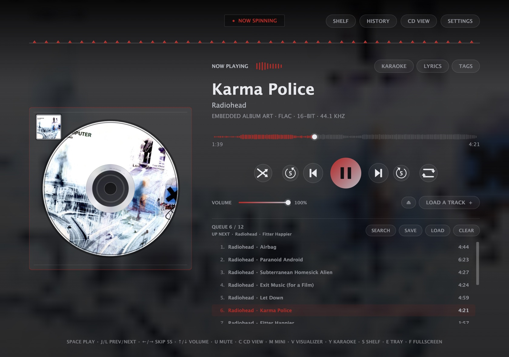
  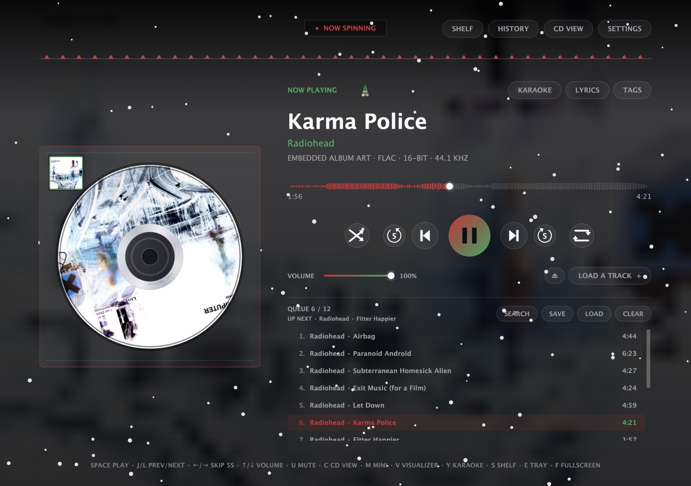
</p>

## Download

Grab the file for your system from the [**Releases**](https://github.com/Kizarov3/CDPlayer/releases) page:

| System | File | How to run |
| --- | --- | --- |
| **macOS** (Apple Silicon and Intel) | `CDPlayer-x.y.z-mac.dmg` | Open the `.dmg`, drag **CDPlayer** into **Applications** |
| **Windows** 10 / 11 | `CDPlayer-x.y.z-windows.exe` | Double-click it — no installation, runs straight from wherever you saved it |
| **Linux** (any distro) | `CDPlayer-x.y.z-linux.AppImage` | Make it executable (right-click → Properties → *Allow executing*, or `chmod +x`), then double-click |

When a newer version is released, a small **x.y.z AVAILABLE** button appears in the top-left corner of the player — click it to open this page. CDPlayer asks GitHub when it starts and every 15 minutes while it's open, so the button always shows the newest version, and it never downloads or installs anything by itself.

### First launch

These builds aren't signed with a paid Apple/Microsoft developer certificate, so the first time you open them your system asks you to confirm:

- **macOS:** if you see *"CDPlayer can't be opened because Apple cannot check it"*, right-click the app in Applications → **Open** → **Open**. (Or: System Settings → Privacy & Security → **Open Anyway**.) Only needed once.
- **Windows:** if SmartScreen says *"Windows protected your PC"*, click **More info** → **Run anyway**. Only needed once.
- **Linux:** nothing extra.

The first time it opens, CDPlayer shows a short guide — five cards: putting music on, the disc, the shelf, lyrics, and making it yours. It's always there again in **Settings → HELP**, with a **FAQ** (also [below](#faq)) and every **keyboard shortcut** (or press `?`).

<p align="center">
  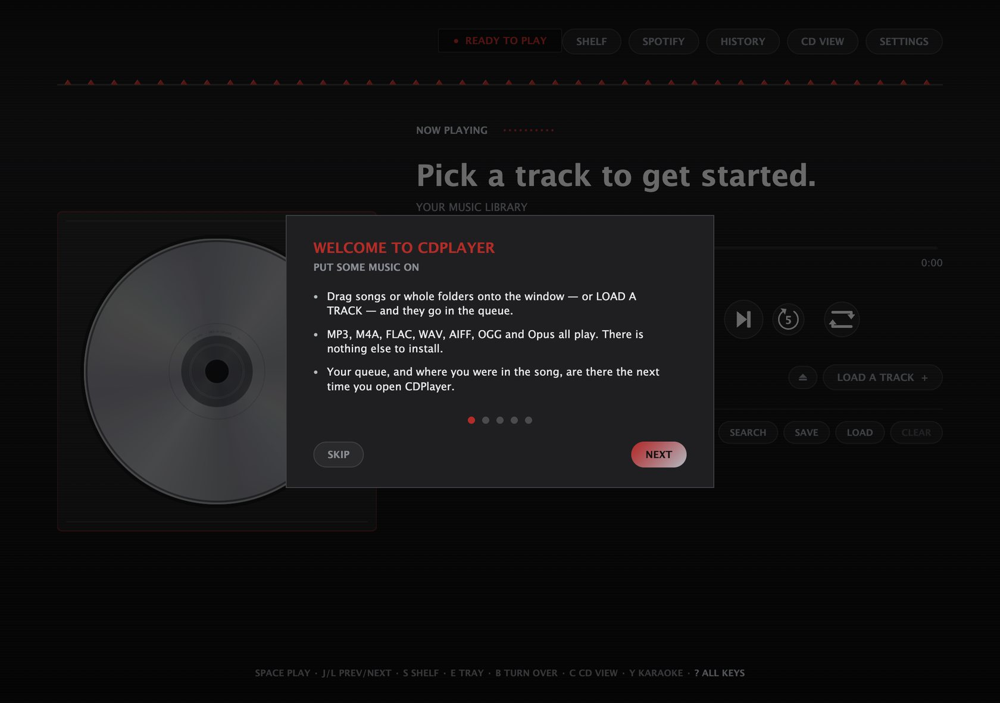
</p>

## Features

**Playback**
- Plays MP3, M4A (AAC and Apple Lossless/ALAC), FLAC, WAV, AIFF, AU, OGG and Opus — all built in
- Drag and drop individual files or whole folders (recursively) to build a queue, or use **Load a Track** — the file picker remembers the last folder you browsed
- Open files straight from Finder / Explorer (*Open With → CDPlayer*) or drop them on the app icon
- **CUE sheets**: an album ripped to one big file plus a `.cue` shows up as its separate tracks, with their own titles, and plays through them gaplessly, like the CD. The FILE line doesn't have to match exactly (a sheet written for `album.wav` finds `album.flac`), and older Windows cue sheets in Cyrillic or Western code pages read correctly
- Shuffle, and a three-way repeat cycle (off → repeat one track → repeat the whole queue), with an "Up Next" preview that always reflects what will actually play next
- Adjustable crossfade (0–15s) on an equal-power curve, so the transition doesn't dip in volume — only when the queue naturally advances, never when you pick a different track yourself
- Volume slider with instant response, blended correctly into an in-progress crossfade
- Mono audio toggle — sums left/right together, for a single speaker or one earbud
- A 10-band graphic **Equalizer** (31Hz–16kHz) with 8 built-in presets (Bass Boost, Treble Boost, Vocal, Rock, Pop, Classical, Electronic, Flat) plus your own saved presets
- The seek bar can show the track's real amplitude shape instead of a plain line
- True fullscreen (`F`), and keyboard shortcuts for everything (see below)

**Audio CDs** (macOS, Windows and Linux)
- Put a real CD in your drive and an **AUDIO CD** button appears — named, a moment later, from MusicBrainz (by the disc's ID, the way Apple Music and rippers name CDs), with the album's cover on the disc. Click it and the disc goes in through the tray and plays; every track has its real name
- Opening the tray (`E`) on a CD that's playing ejects it from the drive; take a disc out and it leaves the queue
- Works with the drive macOS mounts, and GNOME's on Linux. On Windows, which only shows an audio CD as shortcuts with no audio behind them, CDPlayer reads the drive itself (a small helper in Windows PowerShell, nothing to install). Names stored on the disc itself (CD-TEXT) aren't read — MusicBrainz knows far more discs anyway
- **RIP** saves the disc into your music folder as lossless **FLAC** — `Artist/Album (Year)/01 Title.flac`, tagged from MusicBrainz with the cover inside and a `cover.jpg` beside them — so it's on the shelf and plays without the disc. Every file is decoded back and compared with the disc's audio before it's kept. Keep listening while it rips; click **RIPPING** for the list of tracks (done, being read, still to come) and **CANCEL RIP**. The FLAC encoder is CDPlayer's own, in JavaScript: nothing to install

<p align="center">
  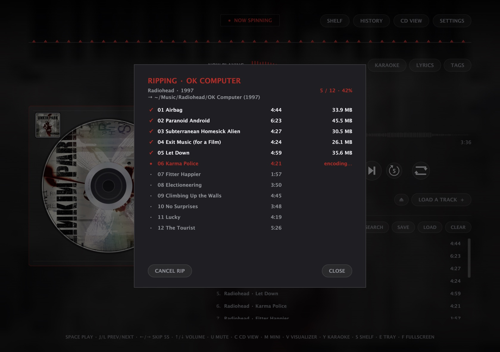
</p>

**The CD shelf**
- **SHELF** (`S`) stands every album in your music folder on a shelf, spine out — each spine in the colours of its cover, a double album in a double-width case — sorted by artist and year, with a box to find one
- Albums come from the tags (album artist and album, so a set split into `CD1`/`CD2` folders is one album), or the folder for untagged music; covers from a `cover.jpg`/`folder.jpg` beside the files or the art inside them
- Click a spine and the case slides out and turns to its front: the cover and tracklist, **PLAY** (the tray comes out, the disc goes in, the tray closes and it plays — or click a track to start there) and **ADD TO QUEUE**
- Or pick a spine up and carry it off the shelf: the shelf fades so the player shows through — drop it on the disc to play it, or on the queue to add it
- Click the case's cover and the album's **booklet** lifts out: its whole tracklist, every song's lyrics (found online as you read), the credits and the back cover — marked in pen as you play it: tally marks beside each song, your favourite circled, and on the back cover when you first spun it and when you last did
- An album with no art of its own (a Music.app library keeps its artwork to itself) gets its cover found online; album names that differ only in punctuation are one album
- What's on the shelf is remembered, so only new or changed files are read the next time
- **SORT** stands it by artist, newest in your music folder, most played, year or colour (round the rainbow, by each cover's most common vivid colour), with cardboard divider cards between the letters, months or decades, like a record shop's
- **Dust**: an album nobody's played in a month starts gathering dust on top of its case, thicker the longer it's left, up to six months. Rub the mouse back and forth over the spine to wipe it off — it stays clean until dust settles again. **PULL ONE** takes an album off the shelf at random, the dustier the likelier
- **Shrink-wrap**: an album that turns up in your music folder comes sealed in plastic, glinting on its spine, until you play it — or pull the red tab and drag the film off its case yourself. PLAY tears it off for you
- **The receipt**: tucked behind every case's cover, the till receipt from the (made-up) record shop it was bought at, the day it turned up in your music folder, for the price on its sticker — click its edge to pull it out
- **Sticky notes**: **+ NOTE** on a case sticks a note on its front, written in marker ("lend to Sam", "for the long drive") — click it to change it, × to peel it off. Its corner shows above the spine, and the shelf's search finds albums by their notes too
- **Missing albums**: sorted by artist, every artist on the shelf gets a box after their albums — **+5 MISSING** — counting their studio albums you don't have, from [MusicBrainz](https://musicbrainz.org) (not live records, compilations, EPs or singles). Click it and they stand on the shelf as see-through places, oldest first; click one for its cover and tracklist, **PLAY ON SPOTIFY**, **MUSICBRAINZ**, or **NOT INTERESTED** to never see it again. Looked up as artists scroll into view, and kept for a month. And a case you pull out lists the album's whole tracklist, the songs you don't have in grey
- **CHECK** looks over your music folder for what's wrong: songs with no tags (**FIX TAGS** fills them in from MusicBrainz), albums with no cover (**FIND COVER**, then **SAVE** it into every song), the same song in two files, albums missing a track or two, and files that can't be played — each with **SHOW** to find it in its folder. Nothing is changed or deleted unless you say so
- **Getting about**: an index down the shelf's right edge jumps to a letter, month, decade or colour, whichever way it's sorted, and **⌖ IN THE PLAYER** goes to the album whose disc is in
- Some cases are Japanese editions, with an **obi** round the spine and a yen price; others still wear a shop's price sticker; and an album that turned up in your music folder in the last two weeks has a **NEW** sticker

<p align="center">
  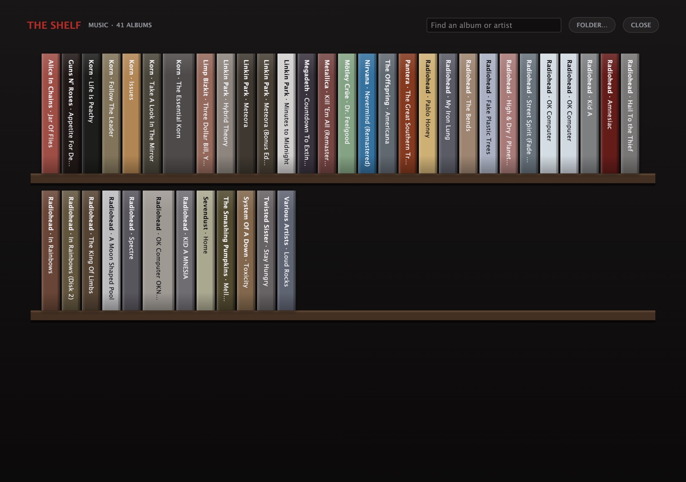
  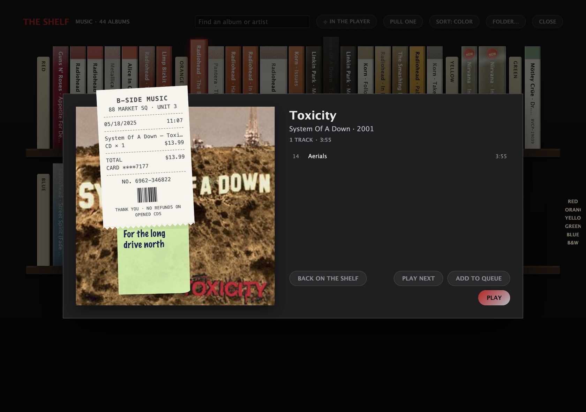
</p>
<p align="center">
  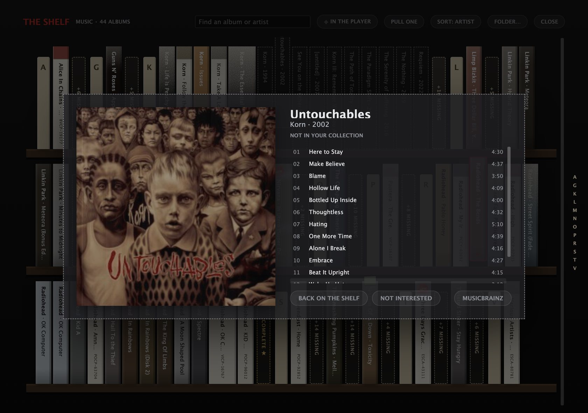
  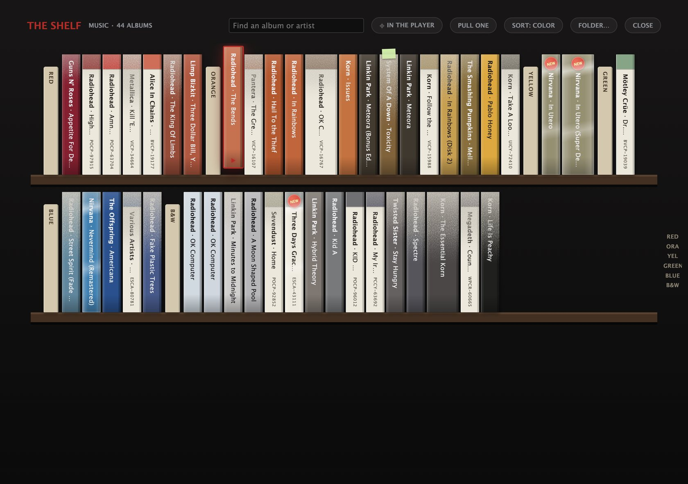
</p>
<p align="center">
  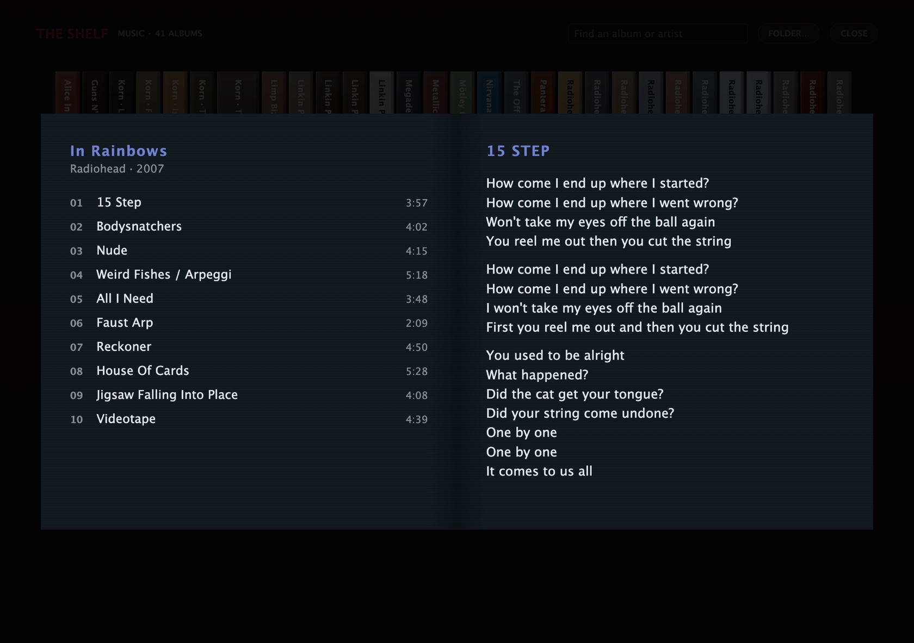
</p>

**Spotify** (Premium)
- **SPOTIFY** lists your saved albums and playlists, with a search. Click one and it goes in as a disc and plays — the tray, the disc, Up Next, shuffle and repeat, lyrics and karaoke all work as for your files, and an album plays through without gaps
- Spotify lets an app play for only five people, so CDPlayer plays through **your own** free Spotify developer app — see [Spotify setup](#spotify-optional)
- Spotify's audio is protected, so the EQ, crossfade, mono, visualizer and waveform don't apply to it, and it can't be ripped. Spotify only shares the songs of playlists you made or collaborate on, not ones you just follow
- **DISCONNECT SPOTIFY** signs CDPlayer out again
- Works on macOS and Windows. On Linux it depends on your system's Widevine support

**Queue**
- Full queue list with per-track duration, click-to-play, and a hover-to-reveal remove (×) button
- Drag any row up or down to reorder the queue, even the one currently playing
- **Clear Queue** — with a few seconds to change your mind: the button turns into **UNDO CLEAR** (or press ⌘Z / Ctrl+Z) — "Up next" preview and live queue position (e.g. `QUEUE 3 / 10`)
- The queue, current track, and exact playback position are saved when you close the app and restored next launch — ready to play, not auto-started
- **PLAY NEXT** (on a shelf case, **NEXT** in Search and History, or ⇧ while dropping a spine on the queue) puts songs straight after the one playing — marked NEXT — and they play next and in order even shuffled; asked again, they go after the ones already waiting
- Save the queue as a standard `.m3u` playlist, or load one back in
- **Search** recursively scans your last-used music folder by filename, filtering live as you type
- Paste a Spotify track or playlist link into Search to queue every matching song you already have locally (nothing is streamed; playlist links need a one-time Spotify sign-in — see [Spotify setup](#spotify-optional))
- **IMPORT LIBRARY…** in Search bulk-imports from an exported iTunes/Music.app `Library.xml` or a Spotify export (CSV, or Spotify's own `YourLibrary.json`), matched against what you already have locally

**Now playing**
- Spinning disc in a jewel case, with your album art printed on the disc like a picture disc (clear plastic hub, mirror band and all) and the case thumbnail — double-click the disc for a little surprise
- A song without a cover gets a silver CD-R with its title and artist written on in marker
- **The disc tray** (`E`, or the ⏏ button): the disc comes out of the case on its tray and playback stops. Drop music on the player while it's out and that's the new disc, replacing the queue; close the tray (`E` again, or PLAY) and the drive reads it — the disc spins up — and plays it from the first track
- **Disc noise** (Settings, off by default): the sounds of a real player — a faint hiss under the music, the tray motor, the disc spinning up — and shaking the window makes the song skip
- The disc catches the light like a real CD: rainbow reflections that follow your mouse around the window, as if you were tilting it under a lamp
- **Disc wear** (Settings, on by default): a disc that's been played a lot looks it — hairline scratches from ten plays of its album, scratches worn round the way it spins and a thumbprint from fifty, nicks out of the rim from a hundred. Every disc keeps its own marks, and the scratches flash as they pass under the light
- **The other side** (`B`, or the ⟲ in the case's corner): turn the disc over to its silver data side, where each track is a ring written from the middle out — as wide as the song is long — and a red laser point reads where the music is. Point at a ring to see its song, click it to play it
- **Turn the disc by hand**: grab it and turn it like a DJ's jog wheel — clockwise forward, anticlockwise back, further the harder you turn it — and let go with a spin to send it coasting. You hear snatches of the song as it goes, like a CD player searching; once it's still, the song plays on from there
- Click the little cover in the jewel case's corner to open the album art full-size in place of the disc
- **The booklet**: click the full-size art and the CD booklet lifts out of the case and opens, printed in the album's own colours — the tracklist (click a track to play it), the lyrics with the line being sung highlighted, the credits (written by, producer, label, catalog number, release date…), how many times you've played the song, and a back cover with the small print and a real barcode when the file has one. ← / → turn the pages; Esc puts it back
- Live audio visualizer driven by the actual audio, pulsing on detected beats, with a shape that changes with the theme
- Artist, title and album from the file's tags, with the filename as a fallback
- The audio quality under the title: `FLAC · 24-BIT · 96 KHZ` for lossless files, `MP3 · 320 KBPS` for compressed ones
- Embedded album art, with automatic iTunes → Deezer → Spotify → [MusicBrainz](https://musicbrainz.org) / [Cover Art Archive](https://coverartarchive.org) cover lookup when a file has none
- **Lyrics** — embedded lyrics, or found online: word-timed lyrics first, from [Unison](https://unison.boidu.dev) (hand-timed, from Better Lyrics) or NetEase Music, then [lrclib.net](https://lrclib.net). Word-timed lyrics found online are used over a file's own line-timed or untimed ones. Timed lyrics highlight and auto-scroll, and clicking a line jumps playback to it
- **Karaoke Mode** (`Y`) — the lyrics fill the window like Apple Music's: each word fills as it's sung, holding on long notes (which glow) and pausing in the gaps, backing vocals under their line, a duet's singers left and right, and three dots breathing through the breaks. It follows what you hear, Bluetooth delay included, and **Lyrics Offset** in Settings moves it for a song timed a little off. Lyrics timed only by line are shared out by syllables
- **Tags** — see what a song's file says and fix it: MusicBrainz fills in the album, album artist, year, track and disc numbers, genre and label (the right recording, as long as the file, on its original album — not a live take or a compilation), with its cover from the Cover Art Archive and the lyrics found online. Tick what to keep, or type your own, and **SAVE TO FILE**. MP3, M4A, FLAC, OGG/Opus, WAV and AIFF; the file is edited as a copy and checked before it replaces the original, and a song that's playing carries on without a hitch
- **Save found art & lyrics** (Settings, off by default) — covers and lyrics found online are written into the song's file once it's finished playing, so they're there offline and in other players too
- **History** — your last 50 tracks, one click away from playing again or adding back to the queue
- **CD view** (`C`) — just the enlarged spinning disc with the title and artist underneath, with a genie-style transition
- **Visualizer Mode** (`V`) — the whole window becomes the theme's audio-reactive visualizer; also kicks in on its own after a few idle minutes while playing, like a screensaver
- **The Dock icon** (the taskbar's on Windows) becomes the disc that's in, cover and all
- **Now Playing card** (`P`, or right-click the disc): a picture of the album in its case and the song, with lines of its lyrics — the one being sung, up to ten you pick, or none — to **COPY** and paste into a chat, or **SAVE…** as a PNG
- System media controls: macOS Control Center, the Windows media overlay and Linux desktop players show what's playing, and hardware media keys work
- **Discord status**: while a song plays, your Discord profile shows *Listening to* the artist, with the song, a progress bar and the cover (when CDPlayer found it online). It talks only to the Discord app on your computer, clears when you pause, and can be turned off in Settings

<p align="center">
  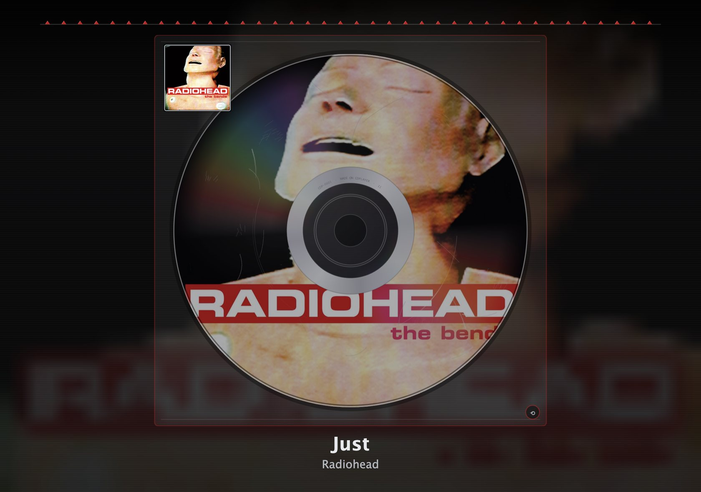
  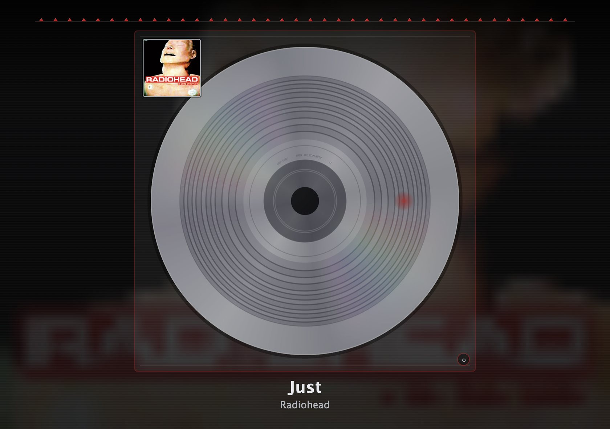
</p>
<p align="center">
  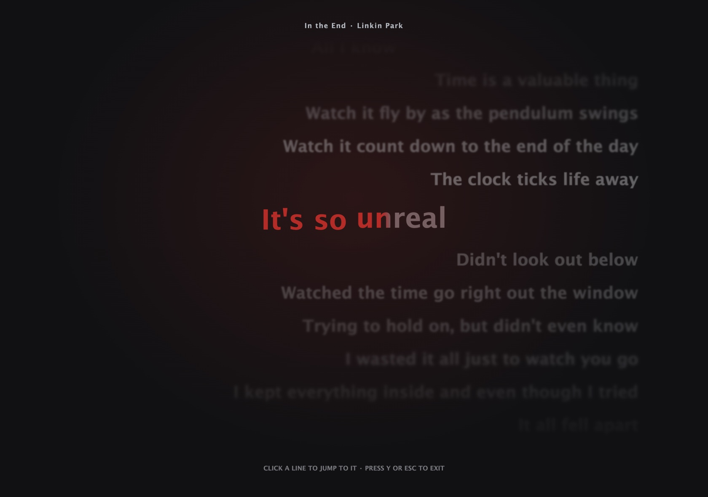
</p>

**Mini Mode**
- Press `M` (or flip the switch in Settings) for a compact always-on-top mini player, styled after Apple Music's: the spinning disc, title and "Artist — Album", a full-width seek bar with elapsed/remaining time, and shuffle · back · play/pause · forward · repeat. On macOS it's frosted glass like a native mini player
- Drag it anywhere (it remembers where); click the disc to play/pause; all the keyboard shortcuts work in it; `M`, `Esc` or the × that appears on hover brings the full player back

<p align="center">
  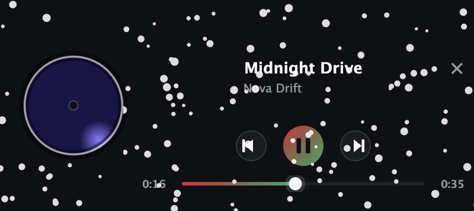
</p>
<p align="center">
  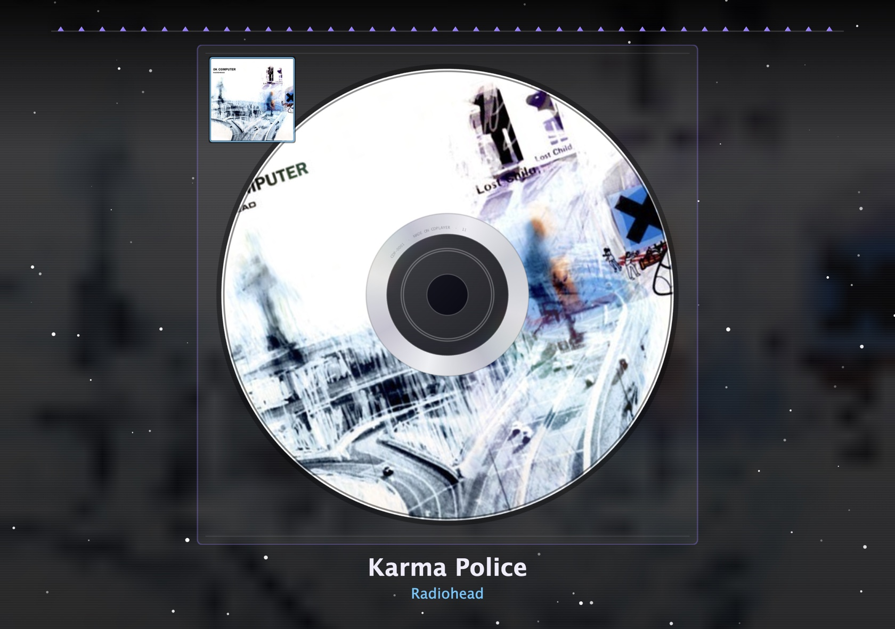
</p>

**Settings**
- Theme, Equalizer, Output, Crossfade, Sleep Timer, Lyrics Offset, Mono Audio, Waveform, Ambient Background, Disc Wear, Animations, Mini Mode and Discord Status in one dialog
- **Help**: the first-run guide again, the FAQ and the keyboard shortcuts
- **Output**: play through the speakers, headphones or AirPods you pick, switched without a pause; unplug them and the sound goes to the system's output, and back to them when they're plugged in again
- **Ambient Background** washes the window with a blurred glow of the current cover art
- **Sleep Timer** pauses playback after up to 120 minutes, with a live countdown in the header (click it to cancel)
- Everything — volume, crossfade, mono, EQ, theme, waveform, animations, window size and position — persists across launches
- **Animations** toggle turns every hover fade, pulse and transition off at once

<p align="center">
  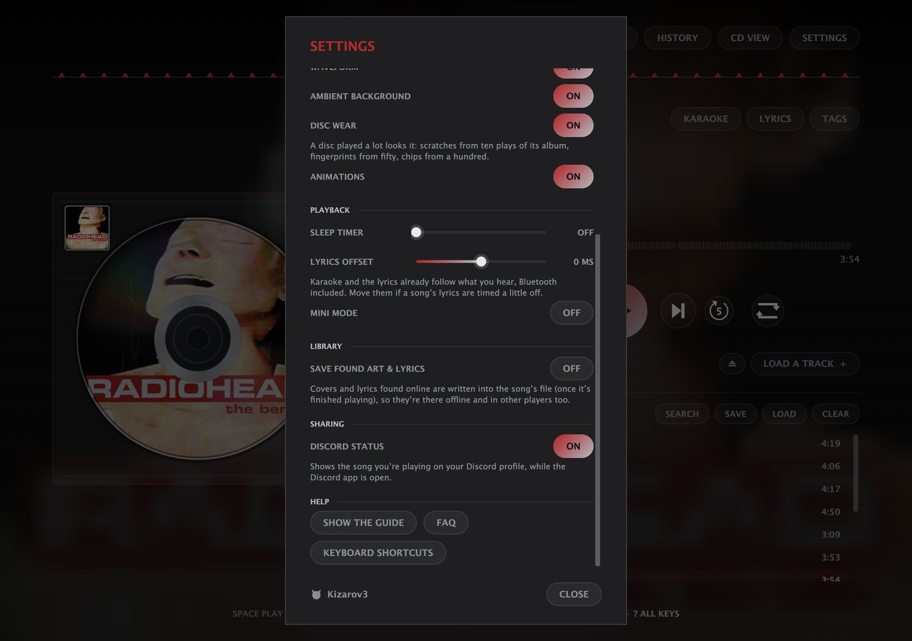
</p>

**Themes**
- Ten themes — RED, BLUE, SUNSET, FOREST, GALAXY, OCEAN, MATRIX, AUTUMN, SNOW and AUTO — with a smooth animated color transition
- **AUTO** derives the whole palette from the current track's album art
- Five themes come with their own animated scenery and visualizer shape:
  - **SNOW** — falling snow; the visualizer is a pine tree whose lights pulse with the music
  - **GALAXY** — a twinkling starfield with shooting stars; a 5-star constellation that brightens with the beat
  - **OCEAN** — rising bubbles; reactive wave layers
  - **MATRIX** — falling green code rain; a miniature rain driven by the audio
  - **AUTUMN** — tumbling leaves; a branch whose leaves grow with the music

## Keyboard shortcuts

| Key | Action |
| --- | --- |
| `Space` or `K` | Play / Pause |
| `J` / `L` | Previous / next track |
| `←` / `→` | Skip back / forward 5 seconds |
| `↑` / `↓` | Volume up / down |
| `U` | Mute / unmute |
| `F` | Toggle fullscreen |
| `C` | Toggle CD view |
| `M` | Toggle Mini Mode |
| `V` | Toggle Visualizer Mode |
| `Y` | Toggle Karaoke Mode |
| `E` | Open / close the disc tray |
| `S` | The CD shelf |
| `B` | Turn the disc over to its data side: a ring for each track, the laser where it's playing |
| `P` | Now Playing card: pick lines of the lyrics, then copy or save it |
| `?` | These keyboard shortcuts |
| `Esc` | Close whatever's open, or leave fullscreen / CD view / Visualizer Mode / Mini Mode |

## FAQ

**My Mac (or Windows) won’t open it — is it safe?**<br>
CDPlayer isn’t signed with a paid Apple or Microsoft certificate, so the first time your system asks. On a Mac: right-click CDPlayer in Applications → Open → Open. On Windows: More info → Run anyway. Only once.

**Why is there no cover or lyrics for a song?**<br>
CDPlayer uses what’s in the file, and otherwise looks it up online by the song’s artist and title. A file named “Track 01” with no tags can’t be found: fix its name with TAGS, which can fill in the details from MusicBrainz.

**Where is my data kept?**<br>
In ~/.cdplayer on Mac and Linux, %LOCALAPPDATA%\CDPlayer on Windows: your queue, history, settings, notes and play counts, as small text files. Your music itself is never changed unless you save tags or found art into it.

**How do I choose the folder my music is in?**<br>
Open the SHELF and click FOLDER… (the first time, it asks). The shelf shows the albums in that folder and everything under it. Songs outside it still play — drop them on the window.

**Why doesn’t the equalizer work on Spotify?**<br>
Spotify’s audio is protected, so it plays outside CDPlayer’s sound engine: the equalizer, crossfade, mono, visualizer and waveform can’t reach it. Your own files get all of them.

**What are the see-through “missing” albums on my shelf?**<br>
Those are missing albums: sorted by artist, each artist’s studio albums you don’t have stand as see-through places, from MusicBrainz. Click one to see it, or NOT INTERESTED to hide it for good.

**Does CDPlayer send anything over the internet?**<br>
Only lookups: covers and lyrics by artist and title, album details from MusicBrainz, and a check for a new version on GitHub. No account, no tracking, nothing about you. Spotify talks to Spotify only if you connect it.

**Why are some albums dusty, or wrapped in plastic?**<br>
An album nobody has played in a month gathers dust (rub the mouse over its spine to wipe it); one new in your music folder comes shrink-wrapped until you play it or pull the film off its case.

## Coming from the Java version?

The original Java app lives on at [Kizarov3/CDPlayer-Legacy](https://github.com/Kizarov3/CDPlayer-Legacy). Your data carries over automatically: CDPlayer 2 reads and writes the same files in the same place (`~/.cdplayer` on macOS/Linux, `%LOCALAPPDATA%\CDPlayer` on Windows) — queue and position, history, settings, EQ presets, last folder and Spotify sign-in. You can uninstall Java and FFmpeg if nothing else needs them.

## Spotify (optional)

Everything else works without it. With it, CDPlayer plays your Spotify albums and playlists (Premium only), and also uses Spotify as a third cover-art source and to resolve pasted Spotify links.

Spotify lets each developer app play for only five people, so CDPlayer uses your own — the **SPOTIFY** button walks you through it:

1. Create a free app at [developer.spotify.com/dashboard](https://developer.spotify.com/dashboard), with **Web API** and **Web Playback SDK** ticked
2. Add the redirect URI `http://127.0.0.1:8080/callback`
3. Under **User Management**, add the email of your Spotify account
4. Paste the app's **Client ID** and **Client Secret** into the SPOTIFY panel, then **CONNECT SPOTIFY**

They're kept in `spotify.txt` in the data folder above. If you set Spotify up for an earlier version, the panel asks you to connect once more: playing needs a few more permissions than importing playlists did.

## Build from source

You need [Node.js](https://nodejs.org) 20 or newer.

```bash
npm install
npm start            # run the app
npm test             # unit tests (decoders, state files, playlists, lyrics)
npm run dist         # build installers for the current OS into dist/
```

`npm run dist:mac`, `dist:win` and `dist:linux` build a specific platform (Windows and Linux builds can be made from a Mac too). Pushing a `v*` tag runs [the GitHub Actions workflow](.github/workflows/build.yml), which tests and packages on all three operating systems, smoke-tests each packaged app by decoding every supported format, and attaches the downloads to a GitHub Release.

### How it's built

- [Electron](https://www.electronjs.org) — the app shell; Chromium's built-in decoders handle MP3, AAC, FLAC, WAV, OGG and Opus on every OS
- Pure-JavaScript decoders in [`src/main/decoders`](src/main/decoders) for the formats Chromium doesn't cover: Apple Lossless (a port of Apple's open-source ALAC decoder), AIFF/AIFF-C and Sun AU — verified bit-exact against reference output in the tests
- [music-metadata](https://github.com/borewit/music-metadata) for tags, cover art and embedded lyrics
- The UI is hand-drawn on canvas to match the original: [`src/renderer`](src/renderer)

## License

MIT — see [LICENSE](LICENSE).

Tags are written with [node-taglib-sharp](https://github.com/benrr101/node-taglib-sharp) (LGPL-2.1-or-later), used unmodified; its source and license are in the app's `node_modules/node-taglib-sharp`.
